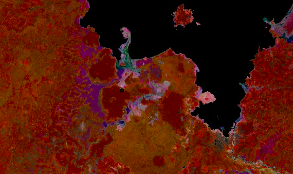
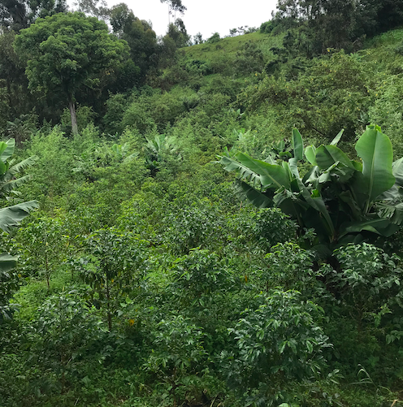

{width=400px}

## About

I’ve loved being in nature since I was young, which led me to major in environmental conservation as an undergraduate. After college, I moved to Ethiopia to serve as a Peace Corps volunteer and worked within the agriculture and forestry sectors. I extended my time as a volunteer and worked with Catholic Relief services to engage with the USAID funded Farmer to farmer program. As I continued to work in Ethiopia, I became more interested in the complex interaction between agricultural systems and nature. These interests led me to the department of international development,community and Environment (IDCE) where I pursued a MSc in Environmental Science & Policy with combined study in Geospatial Analysis and agricultural research. My thesis focused on resilience to climate variability among smallholder coffee farmers in Ethiopia. I examined how smallholder coffee-producing households are adapting their land-use strategies in response to changing precipitation patterns and increased incidence of coffee plant diseases in two different regions of Ethiopia. 

Currently, I am consulting for the International Research Institute for Climate and Society (IRI), Earth Institute at Columbia University. I am working with the Adapting Agriculture to Climate Today, for Tomorrow (ACToday) project to develop the "MyCoffeeFarm" climate services advisory tool for Ethiopia. This tool translates climate and economic information for decision-making and risk management at the coffee farm level.

Overall, I am interested in the intersection of sustainability and data science. My passions revolve around leveraging emerging technologies and data to map climate change vulnerability especially in regards to food security and agriculture development. 

## Interests

* GIS and Remote Sensing
* R and Python programming
* Climate Change impacts and adaptation
* Agriculture and food security
* Risk Assessment (Multi-Attribute Decision Making)
* Rural and urban connectivity in regards to resilience
* International Development
* Environmental protection

## Projects

* Master’s Thesis with grant funded international field research “Climate change threats and opportunities for coffee cultivation in Ethiopia: How are farmers adapting to shifting agricultural scenarios?” Performed 52 farmer/development agent interviews in 4 regions of Ethiopia. Collaborated Ethiopian students, researchers and government agriculture experts to promote coffee sector resilience in Ethiopia. 

* Super Resolution: Developed a workflow to Enhance Planet-scope imagery using deep learning for multi-temporal super-resolution. This process sharpens the planet scope imagery to allow for clear photo interpretations and decision making.

* Vulnerability assessment concerning varied planting dates for farmers in Zambia due to rainfall variability. Utilized rainfall data (CHIRPS) to calculate the coefficient of variation (CV) of NDVI for growing seasons using Google Earth Engine and R. 

* World Resources Institute (WRI) directed research concerning critical analysis of UN Mitigation strategies and the potential impacts on vulnerable communities.

* Attended and Presented at the UNFCC COP25 representing the Youth Constituency. Collaborated with domestic and international graduate students concerning university contributions to UN Sustainable Development Goal #2 “Zero Hunger”. Oversaw and co-moderated a live streamed Press conference concerning SDG 5 “Gender Equality”. 

* Urban climate resilience assessment focused on Addis Ababa, Ethiopia. Research concentrated on rural-urban connectivity, water access, infrastructure and sanitation sectors. Included a literature review for a NGO based in Ethiopia

## Profiles 

* [LinkedIn](https://www.linkedin.com/in/ryan-kopper-526305124/)

* [GitHub](http://github.com/rkopper610)

* [Twitter](https://twitter.com/rkopper610)

## Contact

* [rkopper610@gmail.com](mailto:rkopper610@gmail.com)

{width=400px}
